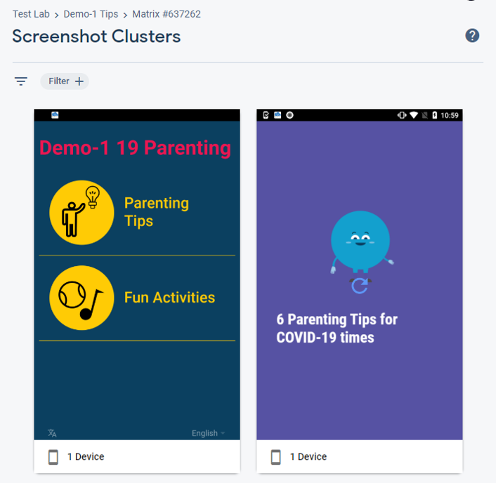

# Automated Testing

## Device Testing

There are various options for device testing locally or cloud-based and on physical or virtual devices. For local testing it is recommended to use Android Studio [Virtual Devices](https://developer.android.com/studio/run/managing-avds). For cloud-based testing the recommended options are [Firebase Test Lab](https://firebase.google.com/docs/test-lab) (5 physical or 10 virtual tests per day free), [AWS Device Farm](https://aws.amazon.com/device-farm/) (no free tier but highly competitive pricing), or [Sauce Labs](https://saucelabs.com/) (unlimited virtual tests for open source projects)

Within these options tests can be configured using various scripting tools such as Espresso and Appium. These docs will use the espresso hybrid app framework, [espresso-web](https://developer.android.com/training/testing/espresso/web).

### Firebase Test Lab

Once an account has been created with firebase, the quickest way to run a test is to upload an apk and select `RoboTest`. This will run a zero-config test in which the device will load the app and attempt to find ways to interact with it. This does not work effectively for hybrid apps, however can be good to check the app installs and loads on different devices.



In order to carry out specific, targetted testing scripts can be created in `Espresso` and uploaded.

Test lab also offers continuous integration for automating testing as part of CI pipelines.
https://firebase.google.com/docs/test-lab/android/continuous

### Espresso Test

These are written in java or kotlin and can be included in the `platforms/android/app/src` folder. NOTE, as this folder is overwritten by ionic on build it is recommended that they are kept separate and copied as required (or integrated into a capacitor build setup).

Typically this will require create a test file in `app/src/androidTest` as well as modifying the `app/build.gradle` file to import required dependencies.

Android does have a function to record tests in a visual way, however this does not work well withy hybrid apps using webview.

Example test to check header text and topic page navigation

```
package international.idems.apps.cortest3

import android.util.Log
import androidx.test.espresso.web.assertion.WebViewAssertions.webMatches
import androidx.test.espresso.web.model.Atoms.getCurrentUrl
import androidx.test.espresso.web.sugar.Web.onWebView
import androidx.test.espresso.web.webdriver.DriverAtoms.*
import androidx.test.espresso.web.webdriver.Locator
import androidx.test.ext.junit.runners.AndroidJUnit4
import androidx.test.filters.LargeTest
import androidx.test.rule.ActivityTestRule
import org.hamcrest.CoreMatchers.containsString
import org.junit.Before
import org.junit.Rule
import org.junit.Test
import org.junit.runner.RunWith

val TAG = "APP_TEST";

@RunWith(AndroidJUnit4::class)
@LargeTest
class ExampleTest {

    @get:Rule
    val activityRule = ActivityTestRule(MainActivity::class.java)
    // http://junit.sourceforge.net/javadoc/org/junit/Before.html
    @Before
    fun initialize() {
        onWebView().forceJavascriptEnabled()
    }
    @Test fun headerDisplayed(){
        Log.d(TAG,"Start Test 1")
        val el =  onWebView().withElement(findElement(Locator.TAG_NAME, "h1"))
        el.check(webMatches(getText(), containsString("19 Parenting")))
        Log.d(TAG,el.toString())
        el.perform(webClick())
    }
    @Test fun canGoToTopicsPage(){
        Log.d(TAG,"Start Test 2")
        val el = onWebView().withElement(findElement(Locator.CSS_SELECTOR, "div[ng-reflect-router-link=\"/topics\"]"))
        el.perform((webClick())).check(webMatches(getCurrentUrl(), containsString("/topics")))
    }
}
```

_platforms\android\app\src\androidTest\java\international\idems\apps\cortest3\exampleTest.kt_

Example update to app build gradle file to import testing dependencies

```
dependencies {

    // ...(main dependencies)

    // Testing
    // Core library
    androidTestImplementation 'androidx.test:core:1.2.0'
    // AndroidJUnitRunner and JUnit Rules
    androidTestImplementation 'androidx.test:runner:1.2.0'
    androidTestImplementation 'androidx.test:rules:1.2.0'
    // Assertions
    androidTestImplementation 'androidx.test.ext:junit:1.1.1'
    androidTestImplementation 'androidx.test.ext:truth:1.2.0'
    androidTestImplementation 'com.google.truth:truth:0.42'
    // Espresso dependencies
    androidTestImplementation 'androidx.test.espresso:espresso-core:3.2.0'
    androidTestImplementation 'androidx.test.espresso:espresso-contrib:3.2.0'
    androidTestImplementation 'androidx.test.espresso:espresso-intents:3.2.0'
    androidTestImplementation 'androidx.test.espresso:espresso-accessibility:3.2.0'
    androidTestImplementation 'androidx.test.espresso:espresso-web:3.2.0'
    androidTestImplementation 'androidx.test.espresso.idling:idling-concurrent:3.2.0'
    // The following Espresso dependency can be either "implementation"
    // or "androidTestImplementation", depending on whether you want the
    // dependency to appear on your APK's compile classpath or the test APK
    // classpath.
    androidTestImplementation 'androidx.test.espresso:espresso-idling-resource:3.2.0'
    // SUB-PROJECT DEPENDENCIES END
}
```

_platforms\android\app\build.gradle_

For more information about writing tests in espresso, see
https://developer.android.com/training/testing/espresso/web
