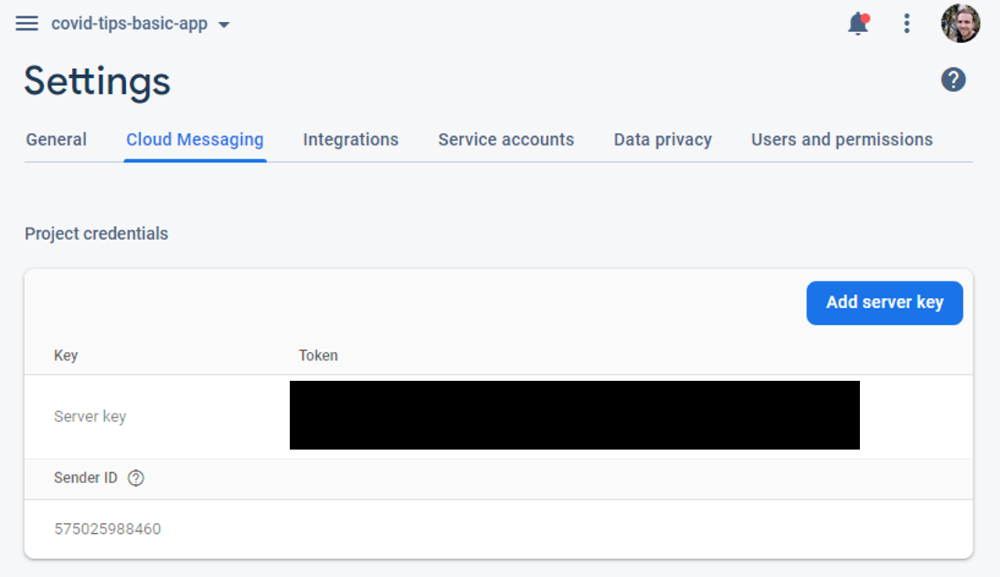
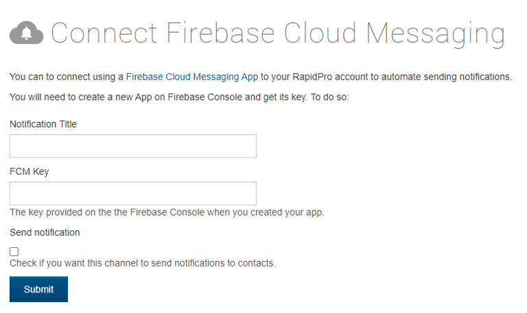

# Notifications

The app uses [Firebase Cloud Messaging](https://firebase.google.com/docs/cloud-messaging) to handle push notifications.

## Receiving Messages

The logic for handling push notifications, subscriptions, etc. can be found in `src/services/notification.service.ts`

## Build Notes

In order to build the app with FCM integrated, a `google-services.json` file must be present in the `platforms/android` folder. The configuration file can be downloaded from the firebase console, or requested from the development team.

TODO - this file will also need to be included in the CI build scripts

## Rapidpro Integration

In order to send messages from rapidpro to the app the following must be done:

1. Add the Connect Firebase Cloud Messaging to rapidpro
   This will require an `FCM key` which can be found in the firebase console

_Access fcm key from firebase console_

_Add key to rapidpro channel_

2. Update the app with the rapidpro server config. This can be added to `src/environments/environment.ts` and/or `src/environments/environment.prod.ts`

TODO - methods and config should ideally be moved to server-side function for security

## Firebase

Messaging is handled through firebase. To join the firebase project, request an invite from the development team.

The project can then be accessed at https://console.firebase.google.com/

http://34.75.7.249/channels/channel/configuration/fdd744a4-82fa-4263-b9fe-6d9c3a516b29/
